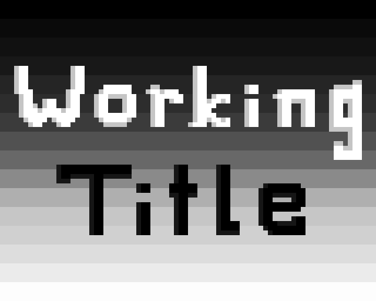
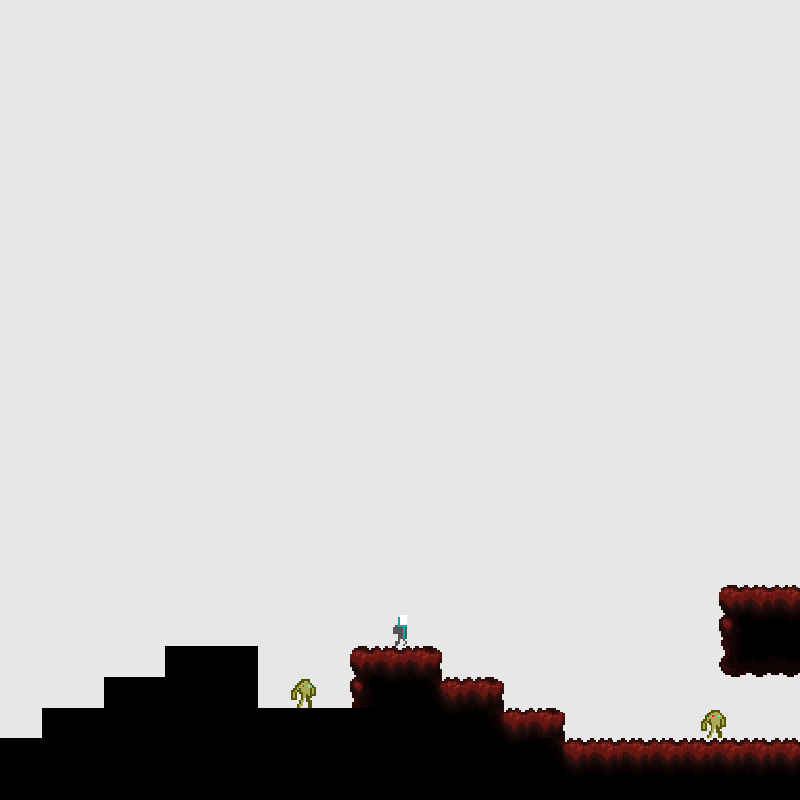
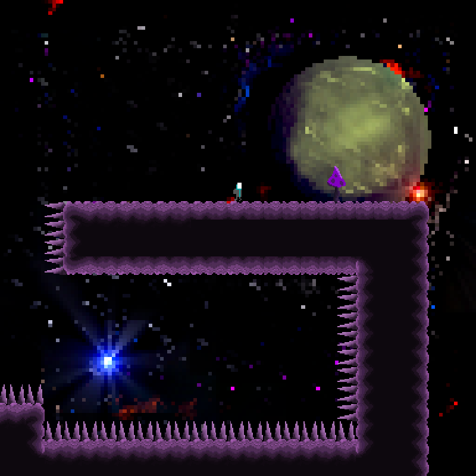

<h1 align="center" bgcolor="black" cell>
  
</h1>

Our [Ludum Dare 45 game jam entry][ludumdare].
The theme...
> Start with nothing

## Screenshots

  
  

## Description
_Experience a work in progress._  

Play through the development process of a 2D platformer game,  
and watch your environment transform as you progress...

The further you get, the more features are added, including  
menacing enemies, destructive spikes, and adaptive music.

## Controls
### Ingame
| Action                         | Keyboard                   |
| :----------------------------- | :------------------------- |
| Move                           | `W`,`S`,`A`,`D`            |
| Jump                           | `Space` / `K`              |
| Toggle Pause                   | `Escape` / `P`             |
| To Main Menu (from pause menu) | `Q` / `Backspace`          |
| Quit Game                      | `Shift+Escape` / `Shift+Q` |

### Main Menu
| Action                             | Keyboard                       |
| :--------------------------------- | :----------------------------- |
| Start Selected                     | `Enter` / `Space`              |
| Start Selected (without save data) | `X` / `Backspace`              |
| Select Next                        | `S` / `Down` / `J` / `Tab`     |
| Select Previous                    | `W` / `Up` / `K` / `Shift+Tab` |
| Quit Game                          | `Shift+Escape` / `Shift+Q`     |

## Downloads
Download the build for your platform from [itch.io][itch].  
Supported platforms: __Windows__ and __Linux__.

## Notes
### Requires Vulkan support to run!
If the game doesn't run, it's likely that you're missing Vulkan API support.  
Unless you're using a very old graphics card,  
updating your graphics drivers should fix the issue.  

If you're on Linux, you may need to install an appropriate  
Vulkan driver package for your graphics card.  
For Intel graphics on Arch Linux (or arch-based distros),  
the package [vulkan-intel] did the trick for me.  

Sorry about this inconvenience, I'm not sure how to circumvent this.

## Change-Log
### v1.0 (jam)
| Version | Download | Release Date | Notes |
| :-----: | :------: | :----------: | :---- |
| __1.0.0__ | [Windows][v1.0.0-windows] [Linux][v1.0.0-linux] | 2019-10-08 _(jam deadline)_               | Initial Ludum Dare jam release.   Has some major bugs, which prevent the game from being completed:   When dying and respawning at a checkpoint, after getting the high-jump feature   you lose your high-jump, which prevents the game from being completed   (unless you beat it without dying).   The order in which the music tracks are played are messed-up;   you won't experience the intended flow of the music in this build. |
| __1.0.1__ | [Windows][v1.0.1-windows] [Linux][v1.0.1-linux] | 2019-10-08 _(~20 minutes after deadline)_ | Partially fixes the music playing-order bug from v1.0.0 (still has some bugs).   Was released about 20 minutes after the deadline. |
| __1.0.2__ | [Windows][v1.0.2-windows] [Linux][v1.0.2-linux] | 2019-10-08 _(~5 hours after deadline)_    | Properly fixes the music playing-order bug.   Fixes the bug where player's high-jump is taken away after respawning, making the game beatable.   Adds frame rate counter system, which prints FPS to the console.   Adds the `WorkingTitle.desktop` file for Linux file manager GUIs.   Some minor, meta stuff.   Was released about 5 hours after the deadline. |

### v1.1+ (post-jam)

    <strong>v1.1.0</strong>

| Download | Release Date |
| :------: | :----------: |
| [Windows][v1.1.0-windows] / [Linux][v1.1.0-linux] | 2019-10-30 |

#### Change-Log
- Change settings to be more low-gravity and feel more like space.
- Add a hover mechanic, where the player can hold down the jump button  
  to slowly hover downwards for the space-y gravity sections.
  - [#14 Add proper hover](https://github.com/Noah2610/LD45-WorkingTitle/issues/14)
- Add four proper levels, each for a different difficulty, from _easy_ to _absurd_.  
  Starts with the _easy_ level and goes to the next difficulty when the level is beaten.
- Add savefile system.  
  When you hit a checkpoint your progress is saved to a savefile,  
  which is loaded when you start the game.
  - [#17 Persistent savefile](https://github.com/Noah2610/LD45-WorkingTitle/issues/17)
- Add red-rectangle ("programmer art") sprites for enemies.
  - [#11 Add no\_sprite animations for enemies](https://github.com/Noah2610/LD45-WorkingTitle/issues/11)
- Adjust animations.
- Bug fixes.

    <strong>v1.1.1</strong>

| Download | Release Date |
| :------: | :----------: |
| [Windows][v1.1.1-windows] / [Linux][v1.1.1-linux] | 2019-10-30 |

#### Change-Log
- Add a player death counter, which is printed to the console at regular intervals.
- Improve performance from previous version.
- Bug fixes, level adjustments, settings tweaks.

    <strong>v1.1.2</strong>

| Download | Release Date |
| :------: | :----------: |
| [Windows][v1.1.2-windows] / [Linux][v1.1.2-linux] | 2019-10-31 |

#### Change-Log
- Update background image, less distracting.
- Level, textures, settings adjustments.

    <strong>v1.1.3</strong>

| Download | Release Date |
| :------: | :----------: |
| [Windows][v1.1.3-windows] / [Linux][v1.1.3-linux] | 2019-11-03 |

#### Change-Log
- Add indicators for when certain features are added (jump, low-gravity).
  - [#16 Add Indicator object, which becomes visible when touched](https://github.com/Noah2610/LD45-WorkingTitle/issues/16)
  - [#18 Add indicator animations](https://github.com/Noah2610/LD45-WorkingTitle/issues/18)
- Fix savefile issues.
- Add pause menu. Toggle with `P` or `Escape`.
  - [#19 Pause menu](https://github.com/Noah2610/LD45-WorkingTitle/issues/19)
- Update levels.
- Add plants tiles.
- Add speedrun timer (kinda). Time is printed to the console.
  - [#12 Speedrun timer](https://github.com/Noah2610/LD45-WorkingTitle/issues/12)
- Animation adjustments.
- Settings tweaks.

    <strong>v1.2.0</strong>

| Download | Release Date |
| :------: | :----------: |
| [Windows][v1.2.0-windows] / [Linux][v1.2.0-linux] | 2019-11-06 |

#### Change-Log
- Add main menu, where you can select the difficulty you want to play.  
  Use _keyboard_ or _mouse_ to select a difficulty.  
  Each difficulty has its own save.
  - [#21 Difficulty select menu](https://github.com/Noah2610/LD45-WorkingTitle/issues/21)
  - [#26 Select difficulty with keyboard in DifficultySelect menu](https://github.com/Noah2610/LD45-WorkingTitle/issues/26)
- Save best level clear times for each level.  
  Display an in-game timer after the level has been beaten once if the timer is running.  
  Display the best time for each level, in-game next to the running timer.
  - [#23 Save best time to savefile](https://github.com/Noah2610/LD45-WorkingTitle/issues/23)
  - [#28 Display timer in-game](https://github.com/Noah2610/LD45-WorkingTitle/issues/28)
  - [#31 Display best time with timer](https://github.com/Noah2610/LD45-WorkingTitle/issues/31)
- Minor paused menu UI changes.
- Reset saved player deaths after beating a level.  
  _(Player deaths are only printed to the console.)_
- The window can be resized by the user.  
  It's recommended to keep it at a 1:1 size ratio (square window).
- Display a different "level complete" text for each level.
- Level changes.
- Tile spritesheets changes.

[v1.0.0-windows]: https://drive.google.com/open?id=1KVx1OpiFyv8DIjm8x0AYwkH_wrwRz_BT
[v1.0.0-linux]:   https://drive.google.com/open?id=1ELAu_Xnh_CRx41qACSeJjiExs5I5Pziu
[v1.0.1-windows]: https://drive.google.com/open?id=1trgy3J-jKcHcjwICZeNqIR1PuSDjjDnb
[v1.0.1-linux]:   https://drive.google.com/open?id=1IqgaudYNlWc_npcTbaSceo0xReDhQn6W
[v1.0.2-windows]: https://drive.google.com/open?id=1thVKQmxqulxDKRW7RW2tMQMt2Cej52VV
[v1.0.2-linux]:   https://drive.google.com/open?id=1aX_bZkpaJTXFlQlgM1Pz4fQY9uryUDYo
[v1.1.0-windows]: https://drive.google.com/open?id=1e1rDkDrPYHpggYph-z2fC0DrMuo5iMKb
[v1.1.0-linux]:   https://drive.google.com/open?id=1yK2RCumiGPkA8FDCibbvzTvcPD_RuYxR
[v1.1.1-windows]: https://drive.google.com/open?id=1BPOKnfXPQITsAkGithX__c1WKvDGlxSQ
[v1.1.1-linux]:   https://drive.google.com/open?id=1Ksz0DiKAGJg3-fNFeLiEggzTc0qUD6o_
[v1.1.2-windows]: https://drive.google.com/open?id=1BjWpFp7PCYf_YvrAeTaLaUFa1a4evrLJ
[v1.1.2-linux]:   https://drive.google.com/open?id=1aiA-f2wL2Wqwd5ugmXM4IJbAxj8MEZJA
[v1.1.3-windows]: https://drive.google.com/open?id=1ekcwnutBPTs11RE8UHmipn-hcf4Tr5Ib
[v1.1.3-linux]:   https://drive.google.com/open?id=1XQGDSQPD2HFGayEryASPSKbUgeILJCqa
[v1.2.0-windows]: https://drive.google.com/open?id=1TtbqwltL4EWI-jgrt7kvdZZrJ_hP7ni0
[v1.2.0-linux]:   https://drive.google.com/open?id=1thHtNAEytx8kSb1vDJlDXYcwnMwpB_4C

## Fonts Used
Used [undefined-medium] for the text at the end.

## Development
[![Build Status][Travis-CI-SVG]][Travis-CI]

### Tools Used
- __[Rust]__, programming language
- __[Amethyst]__, engine
- __[Deathframe]__, framework
- __[Vim]__, code editor
- __[GitHub]__, git repository hosting
- __[Gimp]__, tile/background graphics
- __[Aseprite]__, sprite graphics
- __[FL Studio][FLStudio]__, music
- __[Tiled]__, level design
- __[Travis-CI]__, Windows/Linux executable building

### Compiling from source
You need to have `cargo` installed (preferably `rustup`).  
Run `cargo run --release` to build and run the game with your default toolchain.  
To run the development build with some debug stuff enabled,  
run the provided `bin/run` script; you'll need the rust toolchain  
`nightly-2019-08-13` installed for the development run script.

### Making levels
We use [Tiled] to create levels.  
You'll need to install [Tiled] and [Python].  
We use a custom Tiled export script, which requires Python.  
To use the custom export script, do the following:  
- Enable the python plugin (`Edit -> Preferences -> Plugins`)
- create a new directory under `~/.tiled`  
  `mkdir -p ~/.tiled`
- copy the export script `tiled-export-script.py` to the new directory  
  `cp tiled-export-script.py ~/.tiled/working-title-export.py`
- restart Tiled

The export script should now appear in the drop-down menu when exporting a level in Tiled.

To use the level in-game, copy the exported `.json` level file to  
`resources/levels/level.json`, and copy all `*.ron` files to  
`resources/spritesheets/`, associated with the spritesheet `.png` files used.  
You can use any spritesheets, as long as the `.png` and `.ron` files are  
in the `resources/spritesheets` directory.

The file [DESIGN.md] describes all tile/object properties and object types  
you can use in Tiled, which have meaning in the game.

## License
Licensed under the terms of the [MIT license][mit].

[ludumdare]:        https://ldjam.com/events/ludum-dare/45/working-title
[itch]:             https://noahro.itch.io/working-title
[vulkan-intel]:     https://www.archlinux.org/packages/extra/x86_64/vulkan-intel/
[undefined-medium]: https://github.com/andirueckel/undefined-medium
[mit]:              https://github.com/Noah2610/LD45/blob/master/LICENSE
[DESIGN.md]:        https://github.com/Noah2610/LD45/blob/master/DESIGN.md
[Rust]:             https://www.rust-lang.org/
[Amethyst]:         https://amethyst.rs/
[Deathframe]:       https://github.com/Noah2610/deathframe
[Vim]:              https://www.vim.org/
[GitHub]:           https://github.com/Noah2610/LD45
[Gimp]:             https://www.gimp.org/
[Aseprite]:         https://www.aseprite.org/
[FLStudio]:         https://www.image-line.com/flstudio
[Tiled]:            https://www.mapeditor.org/
[Travis-CI]:        https://travis-ci.org/Noah2610/LD45-WorkingTitle
[Travis-CI-SVG]:    https://travis-ci.org/Noah2610/LD45-WorkingTitle.svg?branch=master
[Python]:           https://www.python.org/
